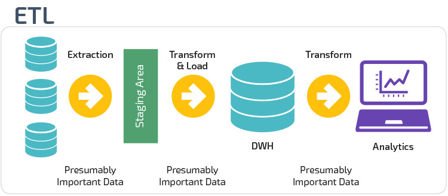
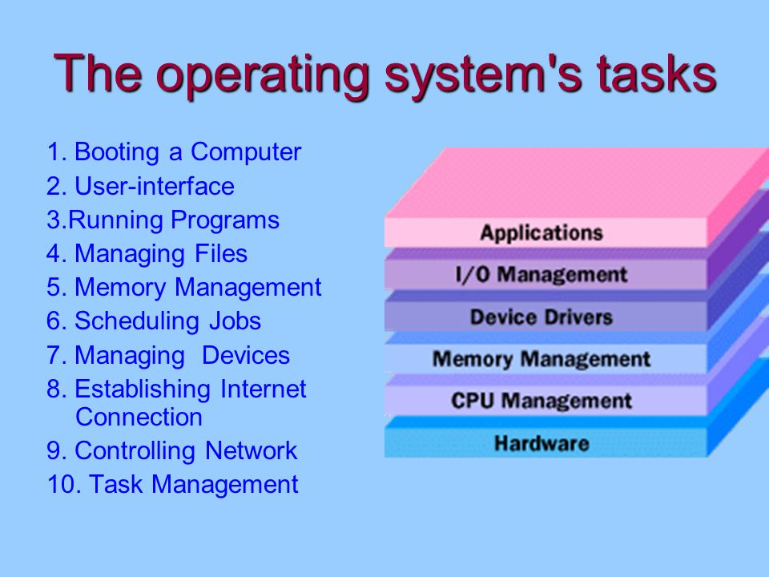

# Diccionario The Egg

# A

### Ada Lovelace
Considerada la primera programadora. Fue la primera en implementar un algoritmo en un ordenador. Hay un lenguaje con su nombre en su honor (Ada)

### Alan Turing
*(Londres, 23 de junio de 1912-Wilmslow, Cheshire, 7 de junio de 1954)*

Uno de los padres de la ciencia de la computación. En el ámbito de IA es conocido el test de Turing, un criterio para juzgar si la inteligencia de la máquina
es inditinguible de un ser humano.

### Algebra booleana
Estructura algebraica que esquematiza las operaciones lógicas.

### Algoritmo 
Es una serie de instrucciones en orden que se deben ejecutar para llegar a un resultado deseado.

### Algoritmo de cifrado simétrico
Clave de cifrado y de descifrado iguales

### Algoritmo de cifrado asimétrico
Clave de cifrado y de descifrado distintas

### API (Interfaz de Programación de Aplicaciones)
Conjunto de subrutinas, funciones, procedimientos que ofrece una librería para ser utilizado por otro software como una capa de abstracción.

### Arduino
Unas placas electronicas de desarrollo de hardware y software libre.

### Arquitectura cliente servidor 
Modelo de diseño de software en el que las tareas se reparten en:
* **Servidores** Recursos
* **Clientes** Demandantes

### Arquitectura Harvard
Arquitectura de computadora con pistas de almacenamiento y de señal fisicamente separadas para las instrucciones y para los datos. Basada en relés que almacenaba las instrucciones sobre cintas perforadas y los datos en interruptores electromecánicos.
Se asigna una memoria específica para los datos y para las instrucciones por lo que no es tan flexible como la arquitectura Von Neumann. Eso sí, puede optimizarse mucho más para llevar a cabo una tarea específica. Por esta razón esta arquitectura es común en sistemas embebidos.

### Arquitectura Von Neumann

No hay una memoria específica asignada para los datos o para las instrucciones. Al ser memoria compartida ofrece mayor flexibilidad ya que puede adaptarse a las necesidades de la tarea. Normalmente se utiliza en ordenadores de propósito general debido a que se le da mejor hacer cualquier tarea pero no puede dar tan buenos resultados como la arquitectura Harvard para una tarea específica.
Arquitectura de diseño para un ordenador digital electrónico que consta de diferentes partes:
* Unidad de procesamiento
* Unidad aritmético lógica
* Registros del procesador
    * Unidad de control
    * Contador de programa
 * Memoria
 * Almacenamiento masivo
 * Mecanismos de entradas y salidas

# B

### Bases de datos 
Conjunto de datos de un mismo contexto almacenados para su posterior uso.

### Bucles en programación
Secuencia que se ejecuta repetidas veces por una instrucción de código.
* while
* for
* do while

# C

### Compilador
Un compilador es un software que genera, a partir de un código de alto nivel, unos ficheros binarios (lenguaje máquina) para que se puedan ejecutar directamente sin necesidad de intérprete.

### Convención de programación
Conjunto de directrices para un lenguaje de programación que recomienda estilo, prácticas y métodos de programación. (gestión de archivos, sangría, comentarios, declaraciones, sentencias, espaciado, nombres)

### Convertidor analógico digital 
Dispositivo electrónico capaz de convertir una señal analógica (tensión o corriente) en una señal digital mediante un cuantificador y codificandose en un código binario. Un código es la representación unívoca de los elementos. Cada valor numérico binario hace corresponder a un solo valor de tensión o corriente.

### CSS
Etiquetas para definir el formato (color, tamaño.. etc) de los elementos de un HTML.

# D

### Data preprocessing
Acumulación y manipulación de datos para generar valor de los datos. 

### Diagrama de flujo 
Representación gráfica de un algoritmo o proceso.

### Dispositivos de red 
* **router:** Dispositivo para conectar redes diferentes
* **Switch:** Dispositivo de red inteligente. Sabe cada mensaje a qué máquina tiene que enviar

### DNS (Sistema de Nombres de Dominio)
Los servidores DNS traducen la dirección de la web en una dirección IP para que el ordenador sepa a qué servidor tiene que conectarse para acceder a los contenidos.

# E

### Editor de código fuente
Editor de texto diseñado para editar código fuente de programas informáticos.
* Aplicación individual
* Entorno de desarrollo integrado (IDE en siglas en inglés) Pycharm, Visual Studio Code

### Estructuras de datos
* **JSON (JavaScript Object Notation):** Formato de texto clave-valor para el intercambio de datos. {hola:'mundo'}
* **XML (eXtensible Markup Language):** Metalenguaje que permite definir lenguajes de marcas.  

### ETL (Extract, Transform, Load)
Extraer datos crudos de diferentes orígenes, transformalos según nuestras necesidades y cargarlos
a una base de datos orientada a procesos analíticos.
* **Extracción:** Bases de datos (MySQL, PostgreSQL), csv, excel,
* **Transformacion:** Filtrar, eliminar, transormar datos, agrupar
* **Carga:** Cargar a la base de datos de analítica.

# F

### FTP (Protocolo Transferencia de Archivos)
Protocolo de red para la transferencia de archivos entre sistemas conectados aa una red TCP, basado en la arquitectura cliente-servidor

### Frecuencia de muestreo
Número de muestras por unidad de tiempo que se toman de una señal continua para producir una señal discreta. 
unidades: Herzios (Hz)

# G

# H

### Hardware
* **Raspberry pi:** Ordenador de placa reducida de bajo costo.
* **Arduino:** Placa electrónica de bajo coste para acercar el uso de la electrónica y programación.

# I

### IP (Protocolo de Internet)
Protocolo de comunicación de datos digitales clasificado funcionalmente en la capa de red.
* **Dirección-IP:** Número que identifica a los equipos o dipositivos de una red.
* **IP pública:** Direccion que te asigna tu ISP para identificarte dentro de Internet.
* **IP privada:** Se utiliza para identificar equipos o dispositivos dentro de una red doméstica o privada.

### Inteligencia artificial
Programa diseñado para realizar operaciones que se consideran propias de la inteligencia humana.

### Internet
Conjunto descentralizado de redes de comunicación interconectada.

### Interprete
Programa informático capaz de analizar y ejecutar otros programas.

# J

# K

# L

### Lenguaje de programación
Lenguaje para escribir una serie de instrucciones en forma de algoritmos para controlar el comportamiento de un ordenador.
#### Lenguaje de máquina
Sistema de código interpretable directamente por un circuito programable. Trabajan con dos únicos niveles de tensión 0 y 1.
Esto permite teoría del sistema binario en el diseño de este tipo de circuitos y en su progamación.
#### Lenguaje de alto nivel
Lenguajes de programación donde los algoritmos se expresan de una manera adecuada a la capacidad cognitiva humana.
Permite un camino bidireccional entre lenguaje máquina y una expresión casi oral entre la escritura del programa y su posterior compilación.
* **Python:** Lenguaje de programación de alto nivel y multipropósito que actualmente tiene muchos usuarios y se utiliza mucho para IA
* **R:** Lenguaje de programación de alto nivel que se usa mucho para temas de estadística
* **Lisp:** Familia de lenguajes de programación de computadora de tipo multiparadigma con larga historia.
* **Java:**
* **DESARROLLO WEB** 
    * **javascript:** Lenguaje de programación de alto nivel que se usa para dar vida a las páginas web
    * **php:** Lenguaje de programación de uso general. Especialemnte para desarrollo web,
    * **html:** Lenguaje de programación para crear estructura y contenido para páginas web
    * **CSS:** Lenguaje de programación para la estética de las páginas web.
* **SQL:** Lenguaje de programación para trabajar con bases de datos.
* **NoSQL**Forma flexible de almacenar, ordenar y captar mayor cantidad de datos. (Cassandra, MongoDB, BigTable)

### Ley de moore
Ley empírica que expresa que cada dos años se duplica el número de transistores en un microprocesador.

# M

### Máscara de subred
Identifica la parte fija de la IP de la parte variable.

# N

# O

# P

### Periférico
Aparatos auxiliares conectadosa la unidad central de procesamiento (CPU) de un ordenador, a través de los cuales el ordenador se comunica con el exterior.
* **Entradas:** Teclado, ratón, micrófono, cámara digital
* **Salidas:** Monitor, impresora, altavoz ...
* **Almacenamiento:** Disco duro, estado solido
* **Comunicación:** Tarjetas de red, módems, enrutadores

### Programación
Creación de programas informáticos para que el ordenador lon interprete y ejecute las instrucciones.

### Protocolos de comunicación
Sistema de reglas que permiten que diferentes entidades de un sistema de comunicación se comuniquen entre ellas para transmitir información. Regras que define la sintaxis, semántica y sincronización de la comunicación.
#### Protocolo TCP/IP (Transmission Control Protocol)
Comunicaciones en redes, describe un conjunto de guías generales de operación para permitir que un equipo pueda comunicarse en una red. Conectividad de extremo a extremo.
#### Protocolo UDP (User Datagram Protocol)
Protocolo nivel de transporte basado en el intercambio de datagramas. Permite el envio de datagramas a través de la red sin que se haya establecido previamente una conexión.

### Puertas lógicas
Dispositivo electrónico con una función booleana/sumar/restar, incluyen o excluyen según sus propiedades lógicas.
Circuitos de conmutación integrados en un chip.

# Q

# R

### red WAN (Wide Area Network)
Red de máquinas que une varias redes locales. Son construidas por organizaciones o empresas para su uso privado.

### red LAN (Local Area Network)
Red de máquinas que abarca una reducida área, una casa, un departamento

### Repositorio de control de versiones
Almacenamiento y gestión del código en la nube
* **Github**
Plataforma de control de versiones git. Microsoft compró en 2018
* **Gitlab**
Servicio web de control de versiones basado en git

# S

### Servidor web 
Programa informático que procesa una aplicación del lado del servidor. Realiza conexione bidireccionales y unidireccionales con el cliente. 

### Sistema binario
Sistema de numeración en el que los números se representan utilizando 0 y 1. Uno de los sistemas que se utilizan en los ordenadores.

### Sistema Operativo (SO)
Software principalde un sistema informático que gestiona los recursos hardware y provee servicios a los programas de aplicación de software.

### Software
Soporte lógico de un sistema informático. Comprende el conjunto de los componentes lógicos para la realización de tareas específicas.

# T

### Transistor
Dispositivo electrónico semiconductor utilizado para entregar una señal de salida en respuesta a una señal de entrada. Se encuentra en todos los aparatos electrónicos que usamos diariamente.

### Transistores bipolares
Dispositivo electrónico consistente en dos uniones PN muy cercanas entre si, que permite aumentar la corriente y disminuir el voltaje.
Regiones: 
* Emisor
* Base
* Conector

# U

# V

# W

# X

# Y

# Z
